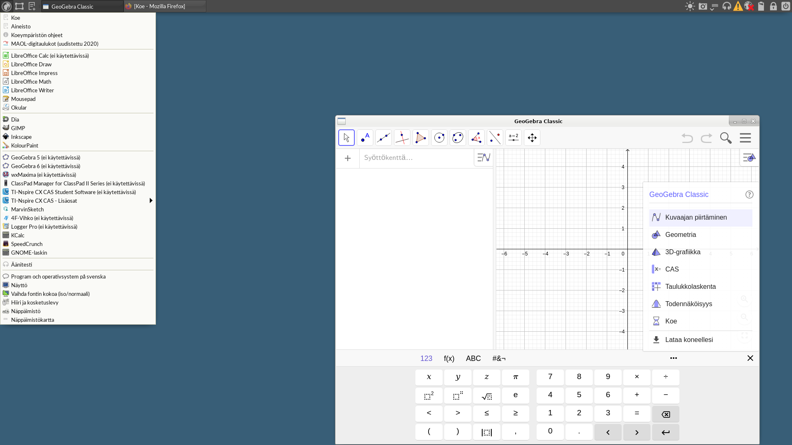
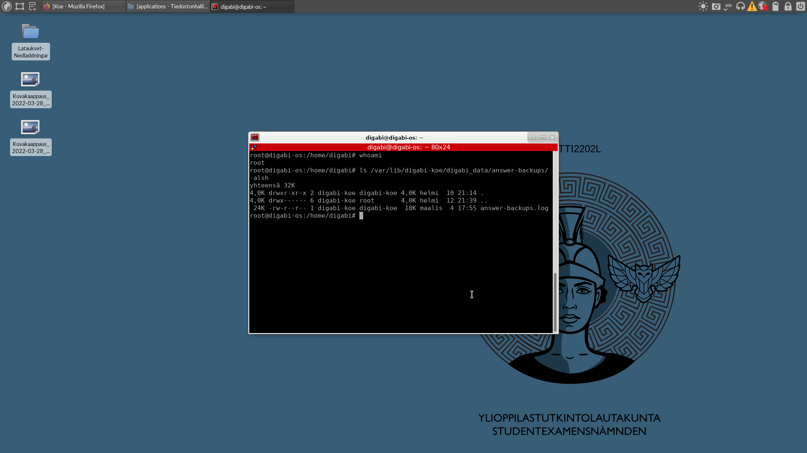

# Haavoittuvuudet Abitti-koejärjestelmässä ja oma.abitti.fi verkkopalvelussa


## ABITTI 2202L

### CAS

Abitin versiossa 2202L CAS-ohjelmat GeoGebra Classic ja 4FNotes on mahdollista käynnistää matematiikan kokeen A-osassa käyttämällä 4FNotesin mukana vahingossa toimitettua ylimmääräistä [Electron](https://www.electronjs.org/) -binääriä, tai muokkaamalla ohjelmatiedostoja avautumaan Firefox selaimessa. Ohjelmat on mahdollista käynnistää koska CAS-rajoitus vain estää suorittamasta tai lukemasta ohjemien binäärejä, muttei muita niiden mukana tulleita tiedostoja, kuten edellämainittua ylimmääräistä Electron binääriä, tai muita ohjelmien resurssihakemistoissa olevia tiedostoja. Haavoittuvuus korjattiin julkaisussa 2216Z estämällä käyttäjää digabi (= kokelaan käyttäjä) lukemasta tai suorittamasta mitään CAS-ohjelmien hakemistoista A-osiossa.

| Kohde            | Sijainti                                              |
|------------------|-------------------------------------------------------|
| GeoGebra Classic | /usr/share/geogebra-classic/resources/app/            |
| 4FNotes          | /opt/4fnotes/resources/app/                           |
| Electron         | /opt/4fnotes/resources/app/tmp/electron/dist/electron |


 **Esimerkkikomento, joka käynnistää GeoGebra Classic:in**

```bash
/opt/4fnotes/resources/app/tmp/electron/dist/electron /usr/share/geogebra-classic/resources/app/
```





### Init

Kokelas pystyy käynnistämään Abitin muunneluilla kernel-parametreilla käyttämällä toiselle levylle asennettua käynnistyslataajaa. Kernelissä on käytössä init-parametri, joka mahdollistaa mielivaltaisen koodin syöttämisen järjestelmään, koodi suoritetaan root-käyttäjällä. Kokeenvalvonta ei luo ilmoitusta teknisen valvonnan virheestä, mutta saattaa tallentaa yrityksen käyttää muokattua komentoriviä lokiin.

**Esimerkki toiselta levyltä käynnistyksestä muokatulla kometorivillä**
```
menuentry "Lataa konfiguraatiolla: Litium ja käytä muokattua kometoriviä" --unrestricted {
  # (hd1,gpt1)/EFI/grub/blaa.efi
  search --no-floppy --label ABITTI2202L --set cmddrive
  search --file --set=root --hint (${cmddrive},gpt2) --no-floppy /live/filesystem.squashfs
  linux           //live/vmlinuz-5.14.9-ytl-buster-wls-amd64 ... init=/bin/bash 
}
```



## oma.abitti.fi

### XSS

Hyökkääjä voi lisätä kokeeseen liitetiedostoksi html-tiedoston, ja käyttää esikatselua suorittaakseen sen sisällön. Kaikki käyttäjät (ja henkilöt jotka eivät ole kirjautuneet sisään) voivat esikatsella minkä tahanka kokeen liitetiedostoja, jos tietävät liitetiedoston polun. Hyökkääjä voi liittää kokeeseen html-tiedoston, joka sisältää XSS-hyökkääyksessä käytettävän koodin ja lähettää linkin tiedostoon kohteelleen, jos kohde avaa tiedoston hyökkääjän luoma koodi voi tehdä pyyntöjä rajapintaan käyttäjän evästeillä, koodi suoritetaan domainissa oma.abitti.fi.


### CSRF

Koeaineiston esikatselun XSS-haavoittuvuutta käyttämällä on mahdollista muodostaa CSRF-hyökkäys oma.abitti.fi:hin. Hyökkääjä voi uudelleenohjata käyttäjän luomalleen aineistolle, joka voi suorittaa käyttäjän evästeillä pyyntöjä rajapintaan, ja uudelleenohjata käyttäjän sivulle jolle käyttäjä alunperin aikoa siirtyä. Uudelleenohjauksia ei välttämättä huomaa monikaan käyttäjä, tai jos huomaa on usein jo liian myöhäistä reagoida ja hyökkääjä on jo ehtinyt tehdä haluamansa pyynnöt rajapintaan.


**Esimerkki hyökkäyksestä:**
<video controls src="csrf.mp4">
